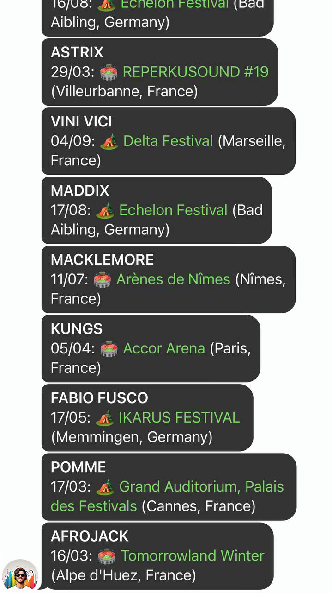

<p align="center"></p>
<h2 align="center">Concert Scraper</h2>

<div align="center">


  
  [](https://github.com/itskovacs/songkick-concerts/issues)
  [](/LICENSE)

</div>

<p align="center"> Python Songkick concert scraper. No API usage. Notify on Telegram.
</p>
<br>

## 📦 About

Retrieve tour dates for specified artists, filter by specified countries and notify you on Telegram.

> [!NOTE]  
A Telegram bot is required. See [Telegram](#telegram) section for setup and ChatID retrieval.

> [!WARNING]  
You're in charge — use responsibly!

> [!IMPORTANT]  
Songkick: "We are currently not approving API requests for student projects, educational purposes or hobbyist purposes" is not acceptable in 2025, period.


<br>

## 🌱 Getting Started

Clone the repo, install the packages and copy the config file.

```bash
  # Clone repository
  git clone https://github.com/itskovacs/songkick-concerts.git
  cd songkick-concerts

  # Create and activate virtual env
  python -m venv venv
  source venv/bin/activate

  # Install dependencies
  pip install -r requirements.txt

  # Configure environment settings
  cp env.dist env.yaml
```
<br>

Edit the config file to fit your needs, it's pretty straightforward:
  - artists you want to follow goes under `artists`
  - countries you wish to get notified about under `countries`
  - Telegram config under `telegram`
  - optional, home town for `city`, will add a 🏠 in the notification to indicate it's in your city

Run the script daily to stay updated on your artists' concerts:
```python
  python songkick.py
```

## 📸 Demo
<div align="center">
  
<br>
</div>


## Telegram  <a name = "telegram"></a>
### Create Telegram Bot
1. Go to your telegram account, then search for `@botfather` and start a conversation with him.
2. Type `/newbot` to create a new Telegram Bot. Name your bot and define its username.
3. BotFather will display your Bot API Token. Copy it somewhere safe (don't worry you can still view it later).

### Retrieve your ChatID
1. Create the channel you want your Bot to post into.
2. Add your newly created Telegram bot into this channel.
3. Send a message with your user to the channel
4. Open Telegram `getUpdates` endpoint in your browser (https://api.telegram.org/bot<your_bot_token>/getUpdates), it will display JSON data
5. In the JSON data, retrieve the value of the key `id` under `chat`.

You're all set to modify the `env.yaml` file with your *Bot Token* and channel *ChatID*.