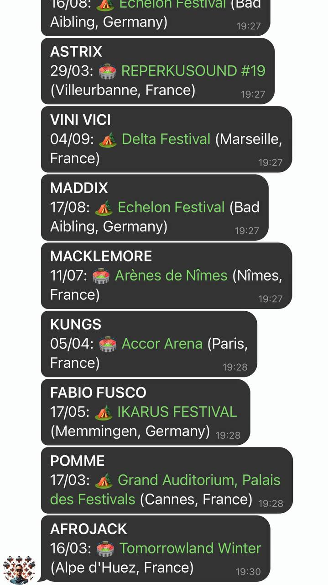

<h2 align="center">Songkick Concert Crawler</h2>

<div align="center">

  
  [](https://github.com/itskovacs/songkick-concerts/issues)
  [](/LICENSE)

</div>

<p align="center"> Python Songkick crawler to retrieve concerts. No API usage. Notify on Telegram.
</p>
<br>

## 📦 About

Quick n Dirty script to crawl Songkick to retrieve tour dates for the specified artists, filter using the specified countries and notify you.

> [!NOTE]  
You must have a Telegram Bot. See below the Telegram section to create a bot if you don't have one. If you don't have the ChatID of the desired group, see below to retrieve it.


> [!IMPORTANT]  
I am not responsible for what you do with this script :)

<br>

## 🌱 Getting Started

Clone the repo, install the packages and copy the config file.

```bash
  # Clone repository
  git clone https://github.com/itskovacs/songkick-concerts.git
  cd songkick-concerts

  # Activate virtual environment
  python -m venv venv
  source venv/bin/activate

  # Install dependencies
  pip install .

  # Copy the example env file
  cp env.example env.yaml
```
<br>

Edit the config file to fit your needs; artists goes under `artists`, countries you wish to get notified about under `countries` and your Telegram config under `telegram`. It's pretty straightforward.

Just run the script daily and you'll get updates about your artists' concerts.
```python
  python songkick.py
```

## 📸 Demo
<div align="center">
  
<br>
</div>


## Telegram
### Create Telegram Bot
1. Go to your telegram account, then search for `@botfather` and start a conversation with him.
2. Type `/newbot` to create a new Telegram Bot. Name your bot and define its username.
3. BotFather will display your Bot API Token. Copy it somewhere safe (don't worry you can still view it later).

### Retrieve your ChatID
1. Create the channel you want your Bot to post into.
2. Add your newly created Telegram bot into this channel.
3. Send a message with your user to the channel
4. Open Telegram `getUpdates` endpoint in your browser (https://api.telegram.org/bot<your_bot_token>/getUpdates), it will display JSON data
5. In the JSON data, retrieve the value of the key `id` under `chat`.

You're all set to modify the `env.yaml` file with your *Bot Token* and channel *ChatID*.